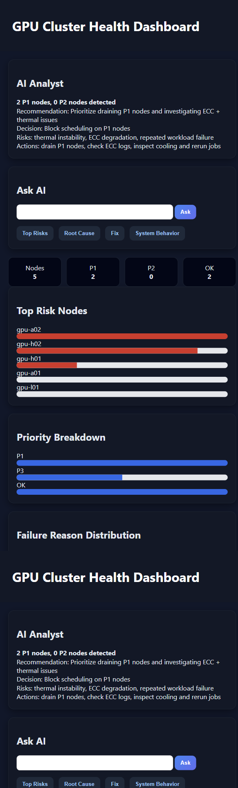

# GPU Cluster Health Triage

GPU Cluster Health Triage is a local operations tool for ranking GPU cluster nodes by health risk using utilization, memory pressure, ECC errors, thermal signals, and job-impact indicators.

## Product Screenshot



It pairs deterministic triage scoring with a local AI analyst so operators can quickly understand which nodes need attention and why.

## What It Does

- Loads GPU node telemetry from local sample data.
- Computes node health scores and risk categories.
- Highlights memory pressure, utilization imbalance, ECC issues, and likely service impact.
- Ranks nodes by triage priority.
- Displays results and AI guidance in a browser UI.

## AI Features

- Local AI analyst explains cluster health and likely impact.
- AI chat supports questions about node risk and recommended action.
- Recommendations are grounded in deterministic telemetry scores.
- The UI shows operational results and AI insight together.

## Architecture

```text
GPU telemetry
    |
    v
Health scoring + risk ranking + blocker detection
    |
    v
Local AI analyst / chat -> operator explanation + next actions
    |
    v
Browser dashboard
```

## Run

```powershell
run.bat
```

## Local AI Setup

The app supports a local OpenAI-compatible model server. Use `google/gemma-4-e4b` or another small local model.

The deterministic triage engine works without the model.

## Main Files

- `server.py` - local API and AI analyst output.
- `web/index.html` - dashboard UI.
- `agents/Agent.md` - cluster triage AI instructions.
- `samples/` - GPU telemetry data.

## Output

The output includes node health rankings, risk reason codes, recommended operator actions, and AI-generated triage summaries.
